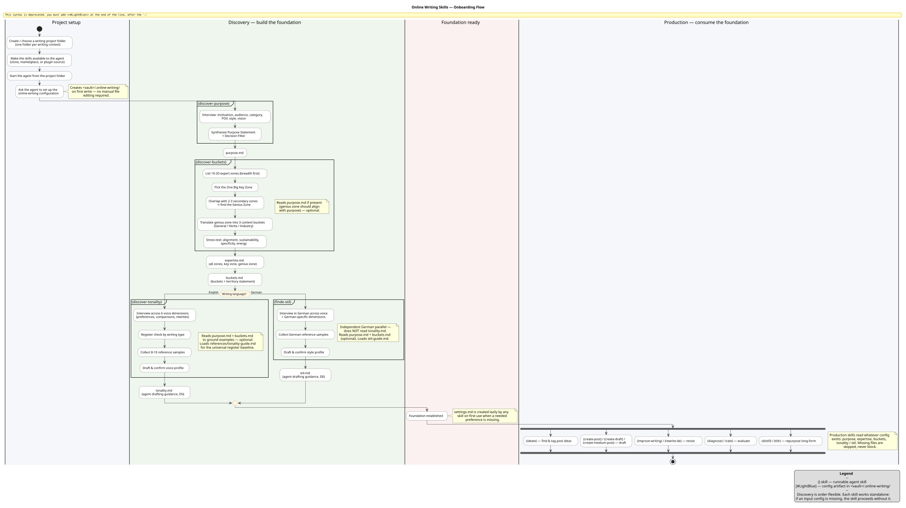

# Online Writing Skills

A skill collection for turning social-first online writing into a repeatable creative operating system.

📖 **Documentation:** https://donheidi.github.io/online-writing-skills/

> **Disclaimer**
> This collection is heavily opinionated and closely aligned with my own writing workflows. It is meant to be useful, adaptable, and inspectable, not universal. Feedback, critique, and suggestions are very welcome.
>
> The skills are highly affected by their project context. Do not expect good results without setting the project context first: purpose, content buckets, and especially tonality. Without that context, produced texts may sound overly marketing- or sales-driven. The workflow works best when the agent has enough local context to understand the writer's actual voice, audience, and intent.

## Purpose

In this repository, **online writing** means public, social-first writing: posts, essays, articles, threads, micro-posts, LinkedIn pieces, Medium-style articles, blog posts, and other formats meant to build an audience, clarify a point of view, and distribute ideas through social media and adjacent publishing channels. It is not general-purpose business writing, private journaling, academic writing, or generic copywriting, although it can reuse material from any of those sources.

This repository contains a suite of AI-agent skills for writers who want more than generic drafting help. The skills are designed to help an agent understand a writer's purpose, content territory, voice, and quality bar, then use that context across the whole writing workflow: finding ideas, exploring angles, drafting posts and articles, improving weak drafts, diagnosing structural problems, rating quality, and repurposing long-form work into shorter platform-native pieces.

The goal is not to automate writing into sameness. It is to preserve the writer's point of view while making the process more deliberate: clearer positioning, sharper ideas, stronger structure, better voice consistency, and more reliable publishing output.

This collection is especially useful when writing is part of a broader professional or creative practice, not just an occasional task. It treats online writing as a system: purpose shapes topics, topics sit inside content buckets, drafts follow format-specific structures, voice is calibrated from examples, and finished pieces can be evaluated and reused.

## Philosophy

AI will change how things on the internet are created. That is not a distant or complicated prediction; it is already happening. Every shift from manual work to automated work has been accompanied by scepticism and rightful critique, and those critiques matter. But they have rarely stopped technological advancement itself.

Generated content has an obvious quality tax. As output becomes easier to produce, the average piece of content can become noisier, flatter, and less worth reading. The answer is not to pretend that AI-generated work will disappear. The answer is to build better workflows, better constraints, and better taste around how it is used.

I believe well-generated content will usually not be noticed as AI-generated content, any more than readers consciously notice the usual writing, editing, framing, and rhetorical tricks already used to transport a message. Bad generated content will be noticed, because it sounds generic, careless, or empty. Good generated content should still feel like it came from a person with a point of view.

This project started from a personal limitation: my chain of thought can be hard to follow and hard to consume. These skills are a crutch in the best sense of the word: a support structure that helps me write more clearly, think through structure, and learn better English prose. I am sharing them because I believe others can profit from that same support structure too.

The focus is on packaging thought, not replacing thought. The skills can help someone explore their ideas, find structure, and turn a messy chain of reasoning into something easier to follow. They are not a one-shot prompting machine for generating good content from nothing. The work still has to be done: deciding what matters, choosing the point of view, revising the argument, and accepting responsibility for the result. The difference is that the work is guided, and much of the mechanical typing and structuring does not have to be done alone.

## What this collection covers

The collection is currently English-first and biased toward American English. Most skills, guides, and examples assume English-language online writing conventions, especially the pacing, directness, and platform norms common in US-oriented business, creator, and professional writing. A smaller subset supports German workflows, mainly around German source analysis, German drafting briefs, rewriting, and style calibration.

- Discovering a writing purpose and decision filter
- Mapping expertise into content buckets
- Defining and applying voice/tonality guidance
- Finding and exploring post ideas
- Creating short-form posts, Medium-style posts, and long-form article drafts
- Rewriting and improving existing drafts
- Diagnosing structural and voice problems
- Rating draft quality against explicit criteria
- Distilling long-form pieces into micro-posts and LinkedIn-length posts
- Supporting a small subset of German-language writing workflows
- Creating image prompts for companion illustrations

Many of these capabilities can also be achieved with ordinary agent prompts and one-off writing tasks. The point of this collection is to turn them into a complete workflow: durable context, guided setup, reusable criteria, project-specific configuration, and repeatable execution across the full online-writing cycle.

## Who this is for

This collection is for people who already have ideas, experience, notes, or opinions, but need help turning that raw material into public writing that is easier to follow and publish. You can read some of my own articles at https://www.sebastian-heitmann.dev/articles/ to get a sense of the writing context this collection grew out of.

It may be useful for:

- Independent consultants who write to clarify their point of view and attract relevant work
- Founders who want to turn hard-won lessons, product thinking, or market observations into public writing
- Technical writers who need to translate complex material into structured, readable, audience-aware pieces
- Researchers and domain experts who want to turn notes, papers, or analysis into social-first writing
- People with many ideas but messy notes, fragmented drafts, or a hard-to-follow chain of thought
- Writers who want structured help without outsourcing their taste, judgement, or point of view

## Sources and influences

This skill collection is based on a set of writing concepts, workflows, and quality criteria inspired by *The Art and Business of Online Writing*, Josh Steimle's work on genius zones, and related online-writing practice: purpose, audience clarity, content buckets, idea-market fit, structural diagnosis, voice consistency, and repurposing long-form material into shorter platform-native formats.

The skills also rely on project-local user material: writing samples, notes, draft history, preferred topics, and the configuration files described in `CONFIG.md`. Those local files are not part of this repository, but they are essential to how the skills adapt from general writing guidance to a specific writer's voice and strategy.

This repository is an independent skill collection. It is not an official companion product, endorsement, or replacement for the source material it draws from.

## Getting started

This collection is intended to be used inside a writing project folder, not only as a global assistant prompt. A project folder gives the agent a clear workspace for one writing context: a personal blog, a founder-led content system, a newsletter, a client project, a research-to-writing pipeline, or any other body of work that should have its own purpose, audience, topics, and voice.

Use different folders when the writing concerns should stay separate. For example:

```text
~/writing/personal-blog/
~/writing/company-content/
~/writing/client-acme/
~/writing/research-notes-to-posts/
```

Each folder can have its own `.online-writing/` configuration, so the same skill collection can support different voices, audiences, and content strategies without mixing them.

### Get the skills

There are several ways to use the collection today:

1. **Download the files from GitHub.** Download the repository as a ZIP or copy the files into a local folder, then ask your agent to inspect the repository and set the skills up for the project you are working in.
2. **Clone the repository.** This is the simplest option if you want to keep the collection up to date with Git:

   ```sh
   mkdir -p ~/skills
   cd ~/skills
   git clone https://github.com/DonHeidi/online-writing-skills.git
   ```

   Later updates are ordinary Git updates:

   ```sh
   cd ~/skills/online-writing-skills
   git pull
   ```

3. **Add it through a local marketplace or plugin source.** If your agent supports local marketplaces, local plugin folders, or skill package sources, point it at the cloned repository instead of copying individual files. This keeps the skill collection separate from your writing projects and makes updates easier: pull the latest repository changes, then let the agent reload or refresh the local skill source according to its own marketplace/plugin workflow.

#### Claude Code example

Claude Code supports plugin marketplaces. The exact UI can change, so the canonical reference is the Claude Code documentation for discovering plugins and marketplaces: https://code.claude.com/docs/en/discover-plugins.md

A local setup typically looks like this:

```sh
mkdir -p ~/skills
cd ~/skills
git clone https://github.com/DonHeidi/online-writing-skills.git
```

Then start Claude Code and add the cloned repository as a marketplace from inside Claude Code:

```text
/plugin marketplace add ~/skills/online-writing-skills
```

You can also add the GitHub repository directly, if you prefer Claude Code to manage the marketplace clone:

```text
/plugin marketplace add DonHeidi/online-writing-skills
```

After adding the marketplace, use Claude Code's plugin manager to inspect and install the available plugin or skills:

```text
/plugin
```

Or use the direct install command shape from the Claude Code docs after checking the marketplace and plugin names:

```text
/plugin install plugin-name@marketplace-name
```

If you update the cloned repository later, refresh the marketplace or reload plugins in Claude Code:

```text
/plugin marketplace update marketplace-name
/reload-plugins
```

The important thing is that the agent can see the `skills/`, `references/`, `CONFIG.md`, and plugin metadata files in this repository.

#### OpenAI Codex example

Codex CLI also supports skills and plugins. This repository ships a Codex plugin manifest at `.codex-plugin/plugin.json` and a repo-scoped marketplace manifest at `.agents/plugins/marketplace.json`, both pointing at the same shared `skills/` directory used by Claude Code.

Clone the repository, then add it as a marketplace and install the plugin from inside Codex:

```sh
mkdir -p ~/skills
cd ~/skills
git clone https://github.com/DonHeidi/online-writing-skills.git
```

```text
/plugins
```

The `/plugins` command lets you browse and install plugins from configured marketplaces. Because the marketplace manifest lives at `.agents/plugins/marketplace.json`, cloning or opening the repository makes the plugin discoverable as a repo-scoped marketplace.

Alternatively, Codex discovers skills directly from `.agents/skills/` (repo) or `~/.agents/skills/` (personal). You can symlink or copy the `skills/` directory into one of those locations if you prefer skill-level discovery without installing the full plugin. The canonical reference is the Codex skills documentation: https://developers.openai.com/codex/skills

### Set up a writing project

The onboarding flow moves from project setup through the discovery skills (which build the durable foundation) into the production skills that consume it:



A typical first project setup looks like this:

1. Create or choose a project folder for the writing context.
2. Make the online-writing skills available to your agent through one of the options above.
3. Start your agent from the project folder, or tell it explicitly which folder is the writing project.
4. Ask the agent to set up the online-writing configuration for this project.
5. Use the discovery skills to establish the foundation:
   - `discover-purpose` — define why you write, who you write for, and what decisions future content should pass. It's an interview, not a form, that moves through four phases:
     1. The Opening — start broad and in life terms ("why are you thinking about writing online right now?") to surface the underlying motivation
     2. Following the Thread — explore whichever of the six dimensions are most alive: motivation, audience, category, point of view, style (educating vs. entertaining), and vision
     3. Surfacing the Purpose — after a few exchanges, reflect back a draft purpose statement synthesizing motivation → audience → category → POV → vision
     4. Sharpening — iterate on the draft until it feels like the user's own, not the agent's

     The result is saved to `purpose.md`: the labeled dimensions, a natural-language Purpose Statement, and a Decision Filter (five yes/no questions) used to evaluate future writing choices.
   - `discover-buckets` — map your expertise into content buckets and topic territory. The interview moves through five steps:
     1. Map expert zones — list 10–20 things you know a lot about (breadth first)
     2. Find the One Big Key Zone — the center of gravity everything connects back to
     3. Find the Genius Zone — overlap the key zone with 2–3 secondary zones to get the unique intersection ("where you have an unfair advantage")
     4. Translate to content buckets — General / Niche / Industry
     5. Stress-test — alignment, sustainability, specificity, energy
   - `discover-tonality` — build an English voice profile from examples and preferences. It weaves three techniques (preference questions, comparisons, and rewrite prompts) across these stages:
     1. Setup — start fresh or refine an existing profile, and load `purpose.md` / `buckets.md` so examples are drawn from the user's actual domain
     2. Interview — extract per-user values across six voice dimensions: Commitment, Reasoning Style, Reader Relationship, Emotional Register, Density, and agent-specific failure modes (the patterns the agent should resist)
     3. Register check — a lightweight pass on how the voice shifts by piece type (descriptive, argumentative, instructional, referential)
     4. Synthesis — present a draft profile in conversation and iterate until the user confirms it sounds like them

     The result is saved to `tonality.md`: a voice summary, the dimension profiles, agent-specific failure modes, register tendencies, format rules, and 8–10 reference samples taken from the user's own rewrites. It's drafting guidance the content skills load to match the user's voice, not a style guide for human editing.
   - `finde-stil` — build a German style profile when the project writes in German.
6. Once the foundation exists, use the production skills for ideation, drafting, rewriting, diagnosis, rating, and repurposing.

Example first prompt:

```text
I want to set up this folder as an online writing project. Please guide me through the initial setup: purpose, content buckets, and voice/tonality.
```

After setup, prompts can become more direct:

```text
Use my online-writing context to explore three angles for a post about AI adoption risk.
Diagnose this draft and tell me why it does not land yet.
Turn this article into five X posts and two LinkedIn shorts.
```

The important idea is that the skills guide both setup and execution. You do not need to fill every configuration file by hand. The discovery skills are designed to interview the user, create the initial configuration, and make later writing tasks more consistent.

## Repository structure

- `skills/` — individual agent skills, each with its own `SKILL.md`
- `references/` — reusable guides used by the skills
- `scripts/` — helper scripts used by specific workflows
- `CONFIG.md` — shared configuration model for writer-specific state
- `assets/` — plugin assets

## Configuration model

The skills expect writer-specific configuration to live outside this repository, typically in a project- or vault-level `.online-writing/` folder. That folder stores durable context such as purpose, expertise, content buckets, and voice guidance. See `CONFIG.md` for the expected files and templates.

This separation keeps the skill collection reusable while allowing each writer's own strategy, voice, and examples to remain local to their workspace.

## Roadmap

Current work focuses on making the collection easier to distribute, better grounded, and more complete as an end-to-end writing workflow:

- Distribution: package and publish the skills through relevant marketplaces and/or Vercel's skills package format.
- References and sources: improve how the workflow uses source material and reference texts. The current direction is to use them in the writing process without naming them directly in the generated text unless the user asks for explicit attribution.
- Images: expand support for companion images, including better image-briefing and prompt workflows alongside written pieces.
- SEO: add support for making texts more search-friendly. The current workflows are written primarily for human readers, and probably AI readers, so SEO is not yet part of the skill set.
- English prose examples: work through *The Elements of Style* by Strunk and White and incorporate further examples of clear, effective English writing.
- Workflow completeness: keep connecting individual capabilities into a coherent system rather than a set of isolated prompts.

## License

Released under the [MIT License](LICENSE). The skills draw on concepts from external sources (see *Sources and influences*); the MIT license covers this repository's own skill definitions, references, and scripts, not the underlying works it is inspired by.
